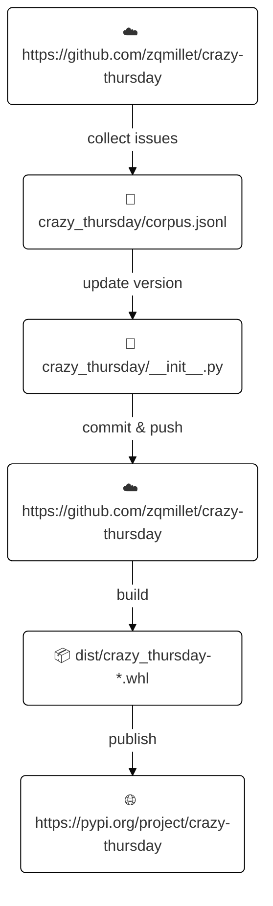

# crazy-thursday

[](https://www.kfchk.com/index.html)
[](https://docs.github.com/actions)
[](https://pypi.org/project/crazy-thursday/)
[](https://github.com/zqmillet/crazy-thursday/actions)

大家好, 我是秦始皇, 其实我并没有死, 我在西安有 100000 吨黄金, 今天肯德基疯狂星期四, 谁可以 V 我 50 元, 我明天直接带部队复活, 让你统领三军!

## 安装 

``` bash
pip3 install crazy-thursday
```

或者
```
python3 -m pip install crazy-thursday
```


## 使用

如果成功安装, 系统中便会存在一个名为 `crazy-thursday` 的命令. 直接调用 `crazy-thursday` 便会在控制台中输出一段疯狂星期四文案.


``` text
$ crazy-thursday
I'm Qin Shi Huang. I'm alive, and I have 100,000 ton golden in Xi'An.
Today is KFC Crazy Thursday, I will let you lead the three armies if
you give me 50 yuan by WeChat.
                                                          by zqmillet
                                         at 2022-09-15T08:39:49+00:00
```

## 如何贡献

你不需要贡献代码, 只需要[创建 issue](https://github.com/zqmillet/crazy-thursday/issues/new), 并且留下文案即可.
后台有一个定时任务, 定时收集本项目的所有 issue, 并汇总打包成 `.whl` 文件, 发布到 [PyPI](https://pypi.org/project/crazy-thursday/) 上.

值得注意的是, 一个 issue 由两部分组成: Title 和 Comment.

- Title 是必填项, 只能有一行.
- Comment 是选填项, 可以有多行, 并且支持 Markdown.

如果你的文案只有一行, 可以把文案写在 Title 中, Comment 留空; 如果你的文案很长, 分段落, 则需要将文案写在 Comment 中.

在执行 ``crazy-thursday`` 命令时, 会优先显示 Comment 中的内容, 如果 Comment 内容为空, 则显示 Title 中的内容.

## 版本号

本项目采用 4 位版本号, 其格式为 `<year>.<month>.<day>.<build>`, 其中:

- `<year>` 为发布时间中的年份.
- `<month>` 为发布时间中的月份.
- `<day>` 为发布时间中的日期.
- `<build>` 为发布当天构建序号, 从 `0` 开始.

比如版本 `1926.8.16.3` 含义为该版本是 1926 年 8 月 16 日构建的第 4 个版本.

## 工作原理

本项利用 Github Actions 每天自动发布版本, 其工作原理如下图所示.



定时任务的工作流程为:

- 首先 clone 项目, 配置 Python, 安装依赖.
- 执行 `scripts/update_curpus.py` 脚本, 自动抓去本项目的所有 issue 并保存到 `crazy_thursday/corpus.jsonl` 文件中.
- 更新 `crazy_thursday/__init__.py` 文件中的版本号.
- 提交 commit 并且 push 回代码仓.
- 将最新的代码打包成 `.whl` 文件, 并发布到 PyPI 上.

该定时任务每天会执行一次, 你提交的 issue 会出现在第二天的版本中.
