# crazy-thursday


大家好, 我是秦始皇, 其实我并没有死, 我在西安有 100000 吨黄金, 今天肯德基疯狂星期四, 谁可以 V 我 50 元, 我明天直接带部队复活, 让你统领三军!

## 安装 

``` bash
pip3 install crazy-thursday
```

或者
```
python3 -m pip install crazy-thursday
```

## 使用

如果成功安装, 系统中便会存在一个名为 ``crazy-thursday`` 的命令. 直接调用 ``crazy-thursday`` 便会在控制台中输出一段疯狂星期四文案.

``` text
$ crazy-thursday
大家好, 我是秦始皇, 其实我并没有死, 我在西安有 100000 吨黄金, 今天肯德基疯狂星期四, 谁可以 V 我 50 元, 我明天直接带部队复活, 让你统领三军!
```

## 如何贡献

你不需要贡献代码, 只需要[创建 issue](https://github.com/zqmillet/crazy-thursday/issues/new), 并且留下文案即可.

后台有一个定时任务, 定时收集本项目的所有 issue, 并汇总打包成 ``.whl`` 文件, 发布到 [PyPI](https://pypi.org/project/crazy-thursday/) 上.

## 系统架构

```mermaid
graph TD
    A[Christmas] -->|Get money| B(Go shopping)
    B --> C{Let me think}
    C -->|One| D[Laptop]
    C -->|Two| E[iPhone]
    C -->|Three| F["hello 🥰"]
```



